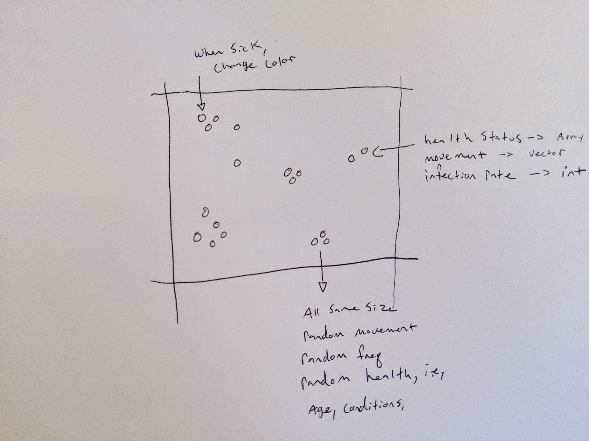
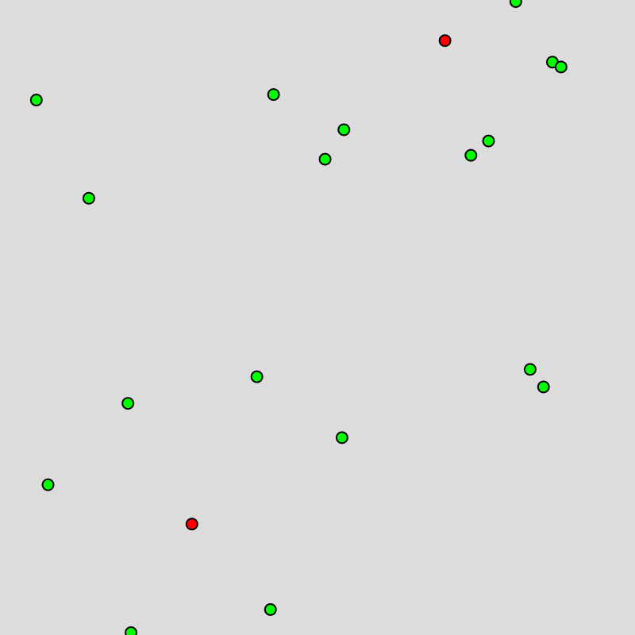
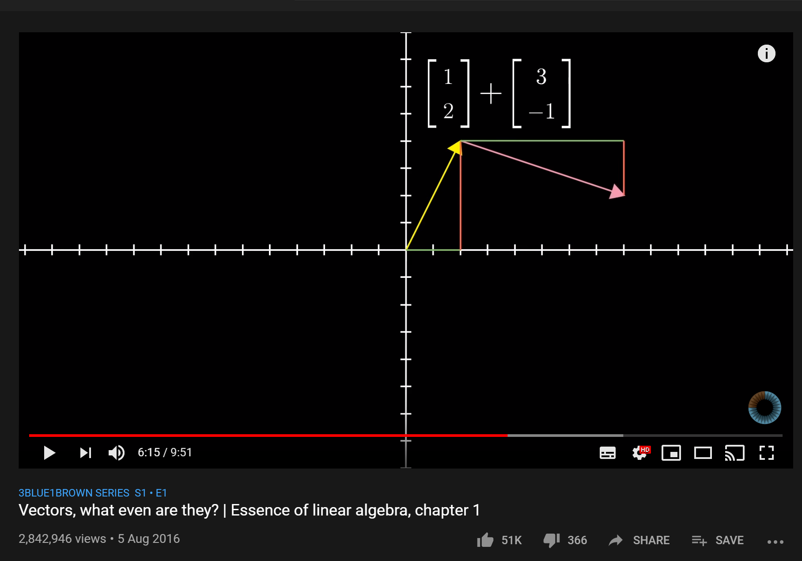

# Visualize Social Distancing
See final project [here](https://kyle1james.github.io/project_of_the_week/visual_social_distance/code/index.html)

*This lesson is meant to be paired with instruction, however, you will be able to follow along and create the final product*

1. [Day One What's the problem?](#Day-One)<br>
2. [Day Two-How do you move like that?](#Day-Two)
3. [Day Three- Watch it spread](#Day-Three)<br>

Might as well learn some awesome js while stuck in-doors. After this project you will understand how to use [p5js](p5js.org) to create in-depth web-based animations/programs, use functions and objects in JS, and understand the general workflow from idea to completion and production. Cool beans.

Once done you will be able to put your program online and share with your friends and family. Let's start!


## Tools
No downloads needed. Hurray! You can save and program all online. Once done, you will be able to share your work with your friends. Here are the tools you will need.

- [p5js reference](https://p5js.org/)
- [p5js online editor](https://editor.p5js.org/)

That's all! What a time we live in. You can, if you like, program this locally. Setup is a tad different.

## Background
For a refresher on functions, checkout my [lesson on JS functions](../js_functions/readme.md).

## Day One

### What's the Problem?

*Music selection for day one- [Iris Dement](https://www.youtube.com/watch?v=jP9LT5HuzrE). Folky, smart, a touch dark, and fun to sing-along with*


Exactly what the heck are you doing and what *really* is the problem at hand? Understanding these two questions is the first step of any project and computer science is no different. It is very tempting to dive right into coding. This, however, is sure to cause headaches down the road- at best.

Let's start be restating the problem and planning out how we want to design our code. It doesn't take that long and is the first sign of serious application.

**The Problem** We want to show why social distancing is important.

**The Idea** By showing how quickly a disease spreads in a population people will better understand the importance of social distancing. We will highlight how even if you don't get too sick you can pass along the illness and make others- whom you might never meet- seriously sick.

**Sketch Out Your Vision**



Cool, my idea is to have tiny circles represent people! These people can move and get sick. The level of sickness will be indicated by the color of the circle and determined by random attributes like health and age.

To make the point of social distancing, I want user's to be able to turn on/off social distancing so they can see how it changes the spread of disease.

### Step Two- Research
There are few things I love more than research! Pure learning for learning's sake is the hallmark of humanity and I'm so happy to be a part of it! Things to research.

- [basic physics](https://en.wikipedia.org/wiki/Dynamical_simulation). How will my people move?
- [disease growth rates](https://plus.maths.org/content/mathematics-diseases). This will fuel how we write our program.
- [covid-19](https://www.worldometers.info/coronavirus/), because that's the disease we want to raise awareness about.
- [objects and functions](https://developer.mozilla.org/en-US/docs/Web/JavaScript/Guide/Working_with_Objects) in js. We want to make sure we are using code that is up-to-date and according to best practices.
- [how is color represented in a computer?](https://www.bbc.co.uk/bitesize/guides/zpfdwmn/revision/2)

We will be dealing a lot with file structure and running different programs as one. For a real deep dive into how this is possible I highly recommend checking out this documentary on Bell Labs.

[](https://www.youtube.com/watch?v=tc4ROCJYbm0&list=LLcGDom9YThSb91Xkgq3-IAA")


### Step Three- Let's Code!

*Make sure to login and save your work!*

Let's head over to [p5js online editor](https://editor.p5js.org/) to begin. We will begin by making a people class in a file called

```text
person.js
```

The file structure is as such:

```text
- index.html
- script.js
- person.js
```

All files are in the same directory.

Nice, Let's initialize this object with the following attributes

```js
class Person {

    // init
    // our person will have location on x,y
    // and age & health
    constructor(x, y, a, h) {
    this.x = x;
    this.y = y;
    this.age = a;
    this.health = h;
  }

    //Functions
    // color will change based on health lvl
    show() {
    if (this.health > 0.5){
      fill(255, 0, 0,100)}
    else{
      fill(255,0,0)
    }
    // 7 is just a random number
    // feel free to change the size
    ellipse(this.x, this.y, 7, 7);

  }
}
```

Make sure to update your index.html to include your new file

```html
  <body>
    <script src="sketch.js"></script>
    <script src="person.js"></script>
  </body>
```
Sketch.js

```js
// this array will hold our persons objects
let population = [];
let person;

// this runs at setup
function setup() {
  // how big should the space be
  createCanvas(400, 400);
  // basic for loop
  for(let i = 0; i < 20; i++){
    // random ints within the canvas space
    let x = random(0,400);
    let y = random(0,400);
    let a = random(0,100);
    let h = random(0,10);
    // create new object using random
    // ints as attributes
    population[i] = new Person(x,y,h,a);

  }

}

// this function actually shows what you have created
// this function will keep running during your program
// this is how we can make 'animations' because commands
// are constantly called.
function draw() {
  background(220);
  // newer for loop syntax
  for(p of population){
    // call class method on each person object
    p.show()
  }
}

```
 hit play and you should see a screen kind of like mine. Remember, all our values are random. So, color count and position will be random!

 

### Make the code your own
- Play around with the random setting for health. How does changing the range change the likelihood of someone being sick? What does this mean for researchers vs. artists?
- Make the size and colors of your class to your liking. What makes sense to you? What is your inspiration? I like letting nature guide me! I might look at the colors of healthy tree leaves vs. unhealthy leaves. This will add a nice touch to the project! More than two colors seems like a good idea, and maybe size could represent age or risk factor.
- Is the canvas to small to large?
- Can you model a population from a certain city? Is 20 too many or not enough?

## Day Two
### How Do You Move Like That?
<br>

Now that we have our person class and can place multiple people on the sketch, it's time to get these people moving! After all we want to show why social distancing is important.

First, let's tackle our person class. By simply adding a speed attribute to our class, we can make a speed move method for our person. Give it a try.

### Step Four- Basic Movement
**person.js**

```js
class Person {

    // init
    constructor(x, y, a, h) {
    this.x = x;
    this.y = y;
    this.age = a;
    this.health = h;
    // new attribute
    this.speed = 3;
  }
 ...

 // move is the new method
  move() {
    //  we are updating the location of x and y
    // by giving a range of - and +
    // play around with the numbers and see
    // what happens!
    this.x += random(-this.speed, this.speed);
    this.y += random(-this.speed, this.speed);
  }
}
```
**script.js**<br>
Before anything happens, we need to update our script.js.
This file has a few small changes. Our setup function is the same. All we need to do is update the methods called on our objects. To do this, we simply update the for loop in the draw function.

```js

...

function draw() {
  background(220);
  for(p of population){
    p.show()
    p.move()
  }
}

```

Press the play button and you should see your people wobbling! Congrats on making your objects move.

### Step Five- Move with Meaning

Our awesome movement in step 4 is great, however, we can make it better. We want to plan out our movements a little by thinking about what could go wrong, what do we want to happen, and what can the computer handle?

We can again research into a few areas.

- [computational speeds](https://en.wikipedia.org/wiki/Big_O_notation) and how does one calculate said speed.
- [algorithm refactoring](https://stackoverflow.com/questions/1857244/what-are-the-differences-between-np-np-complete-and-np-hard) and how one makes code better
- [refactoring code](https://en.wikipedia.org/wiki/Code_refactoring)

**Change our Class**

Below, you can see the actions I wish my object to do. I want a person to

1. show on the screen
2. move around the screen
3. handle the edges of the screen


```js
...

function draw() {
  background(220);
  for(p of population){
    p.show()
    p.update()
    p.edges()
  }
}
```
We can check number one off of our todo list. We want to refactor the code for number two, and we need to plan ahead for number 3. Let's begin!

To start with, we need to update our Person class.

**person.js**

```js

class Person {

    // init
    constructor(x, y, a, h) {
    // create a vector!
    this.pos = createVector(x,y);
    this.age = a;
    this.health = h;
    this.vel = p5.Vector.random2D()
    this.acc = createVector(0,0);
    this.mass = random(7,12)
  }
}
```

A few things changes. Firstly, we've added vectors using the p5 built-in method createVector. You can think of a vector simply as a direction or path that an object is moving in. You can included a lot of things in the description of a vector. We are going to include the speed at which a person is moving.

You will notice that position is now a vector, meaning if I want to call this.x, I now need to play by the data structure's rules, e.g., this.pos.x.

**Rabbit Hole**<br>

A lot of computer science deals with vectors, it's the bread and butter of machine learning. This is a great place for a deep dive into some research! I highly recommend checkout out the following:

[]https://www.youtube.com/watch?v=fNk_zzaMoSs)

At the very least, I'd check out the [p5js documentation on vectors](https://p5js.org/reference/#/p5/createVector).

Awesome, next we want a move complex movement function. We don't want people to just wiggle about! So, we will apply some very basic physics to get an affect of walking.

```js
update() {
    // add vel to postion
    this.pos.add(this.vel);
    // add acc to vel
    this.vel.add(this.acc);
    // try uncommenting the below line
    // and watch what happens!
    //this.acc.mult(0)
  }
```

Lastly, I want to update my show function so that I may represent age in a circles mass, e.g. adults are larger than children.


```js
   show() {
    // play around and change for range
    // of colors
   if (this.health > 20){
     fill(0, 255, 0)}

   else{
     fill(255,0,0)
     if (this.age < 30){
       fill(255,255,0)
     }
   }

   // update part
   // a new way to call x,y
   // update size based on mass
   // can you make mass dependent on size?
   ellipse(this.pos.x, this.pos.y, this.mass, this.mass);
 }
 ```
### Make it your own
- Can you make the size of the object dependent on the age?
- How fast should people move? Do all people move at the same speed?
- What happens when a person leaves the edge of the screen? What can we do?
- How could we show movement patterns? Right now it is random.
- Just have fun playing with vectors!

### Next Time

 We will focus on the following problems
 - Our people wander off the map!
 - Contact with a sick person, what should happen?

## Day Three
### Watch it spread

The goal of day three is to write a function that spreads the disease. We can imagine this as two or more dots coming in a certain range of each other. Then, depending on age, health, and exposure the dot will either get sick with symptoms- turn red-, get sick with no symptoms- turn yellow- or stay healthy.


This is done pretty simply. In our class we create a new method called touch that takes in another object.

```js

touch(other){
  // get distance between two dots
  let d = dist(this.pos.x, this.pos.y, other.pos.x, other.pos.y);
  // if that distance is "touching"
  if (d < 10){
    // give a random chance of being sick
    // you could easily make this based off of current Understandings
    // for how the disease spreads based on age, health, etc.
    let sick = random(0,100)
    if (sick > 75){
      // this.health triggers the colors change
     this.health -= 10;
    }
  }
}
```
Next, we need to set this up in our sketch.js file. An easy but costly way to run this function is inside a nested loop. A great challenge would be to figure out a computationally quick way to have a "touch" method.

```js

for(p of population){
  p.show()
  p.update()
  p.edges()
  // nested for loop
  for(pp of population){
    if (p != pp){
    pp.touch(p)
    }
  }
}
```

### Next Steps
How can the user interact with this project to change values like social distancing or population density? Check out next week's project which is all about user input! The js way is in the source code, however, this is quite clunky. Next week, we will look at jQuery and the ease of DOM manipulation with this library.  
